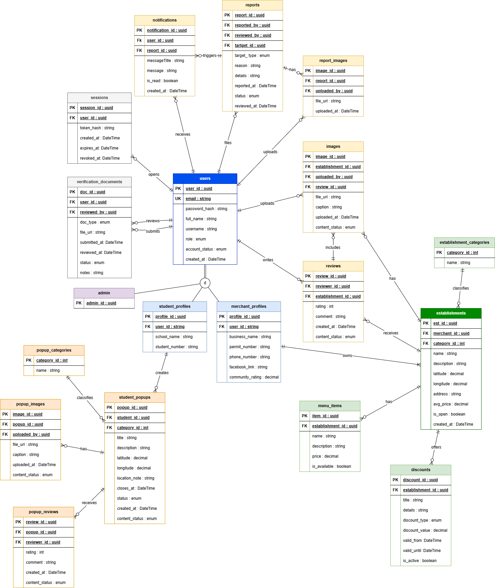

# IskOut

> *Iskolar* + *Scout* — A verified-only community map for Filipino students.

IskOut is a strictly moderated Android application that connects verified students with trusted, budget-friendly karenderias and student-friendly services near their campus. Every user — student or merchant — is manually verified before gaining access, ensuring a scam-free, harassment-free experience.

---

## The Problem

Student Facebook groups and group chats are overrun with scam posts, vulgar content, and unverified strangers. When students ask for food recommendations, they rely on unmoderated word-of-mouth with no way to confirm if a place is safe, affordable, or still open. There is no dedicated, trusted space built for the student experience.

## The Solution

IskOut locks access behind identity verification and replaces the chaos of unmoderated groups with a live, curated map — think Google Maps, but exclusively for students and verified local merchants.

---

## Features

### Verification-First Access
- Students register with a **School ID**
- Business owners register with a **Business Permit**
- All accounts enter a **Pending** state until manually approved by an admin
- No outsiders, no trolls, no unverified accounts

### Interactive Map Dashboard
- Live map centered on the user's **current location**
- Nearby verified karenderias, cafes, and student-friendly spots appear as pins
- Each pin shows community ratings, menus, and active promos

### List View with Smart Sorting
Switch from the map to a list of nearby spots, sortable by:
- **Nearest** — default, sorted by proximity
- **Rating** — highest community-rated spots first
- **Price** — most budget-friendly first
- **Busy-ness** — avoid peak hours
- **Discounts** — filter to only show places with active student deals

### Merchant Portal
Verified business owners can manage their listing, post menus, update prices, and publish flash discounts in real time directly to the student map.

### Verified Badges & Community Ratings
Every profile carries a **Verified** badge backed by document approval. Students rate and review spots, building a trusted, self-sustaining reputation system.

---

## Roadmap

- [x] Project setup and base architecture
- [x] Login screen UI
- [x] License and documentation
- [ ] Registration with document upload
- [ ] Admin verification dashboard
- [ ] Google Maps integration
- [ ] List view with sorting filters
- [ ] Merchant portal
- [ ] Community ratings and reviews
- [ ] Push notifications for verification status

---

## Target Users

| User | Need |
|---|---|
| **Students** | Safely find cheap, nearby food without sifting through spam |
| **Business Owners** | Advertise directly to a verified, relevant student audience |
| **Student Admins** | Moderate a trusted platform without chaos |

---

## Entity Relationship Diagram(ERD)

---

## License

Copyright (c) 2026 Vince Mathew L. Silva — All Rights Reserved.

This project and its source code may be viewed for portfolio and evaluation purposes only. No part of this project may be copied, modified, distributed, or used as the basis for another product without explicit written permission from the author.
